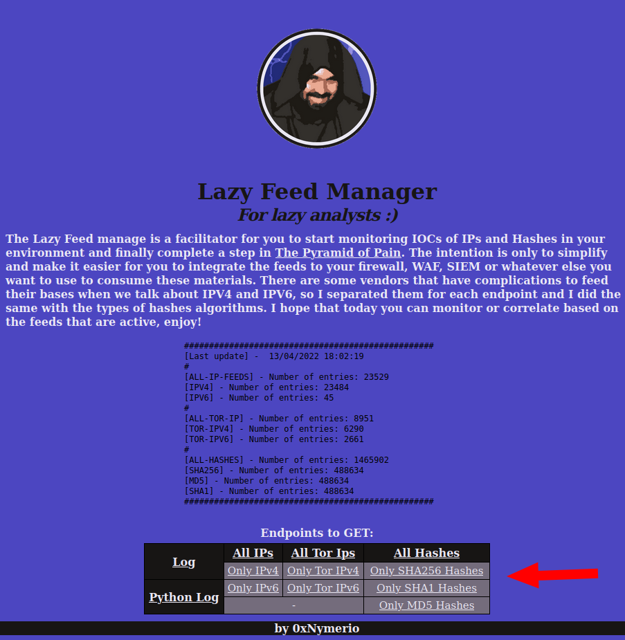

# Lazy Feed Manager
I see a great difficulty for analysts and companies to start looking at the bottom of [The Pyramid of Pain](https://www.sans.org/tools/the-pyramid-of-pain/) to collect and correlate their logs with IOC IP's/Hashes provided by intelligence feed bases. As a solution, they install [MISP](https://github.com/MISP/MISP) (which is a great tool) to manage the feeds, but in the end it is a cannon to kill a fly, not practical at all. There are easier ways to manage these intelligence feeds and facilitate the work of analyzing and correlating logs, MISP has much more than just offering a feed manager and it is in this space that **Lazy Feed Manager** comes into play, **a solution for lazy analysts!** :)

**Lazy Feed Manager** fulfills only one role, get you out of square one in 2 minutes and make it easy for you to integrate security feeds with your Firewall, WAF, SIEM or anything else. It already has some feeds in freetext format, so don't add a feed in csv format because it won't interpret correctly. **Lazy Feed Manager** goal is to be simple and easy to use, that's all.

## Active Feeds
- https://s3.i02.estaleiro.serpro.gov.br/blocklist/blocklist.txt
- https://lists.blocklist.de/lists/all.txt
- https://raw.githubusercontent.com/stamparm/ipsum/master/levels/8.txt
- https://raw.githubusercontent.com/stamparm/ipsum/master/levels/7.txt
- https://raw.githubusercontent.com/stamparm/ipsum/master/levels/6.txt
- https://raw.githubusercontent.com/stamparm/ipsum/master/levels/5.txt
- https://raw.githubusercontent.com/stamparm/ipsum/master/levels/4.txt
- https://raw.githubusercontent.com/stamparm/ipsum/master/levels/8.txt
- https://secureupdates.checkpoint.com/IP-list/TOR.txt
- https://www.dan.me.uk/torlist/
- [Malware Bazaar](https://bazaar.abuse.ch/export/) - Full list (SHA256, SHA1 and MD5)

## Requirements
- Docker 
- Python 3 (if you want to test out of a container, of course)
- Install Python 3 Requeriments
  
## Instalation
Using this tool should be as simple as cloning, building and running.
>sudo docker image build -t lazy_feed_manager:1.0 . && sudo docker container run -d -p 80:80 lazy_feed_manager:1.0

## Usage
Just GET a endpoint as shown in the index table, so it is possible to access the IOCs as needed or the logs generated by the tool.

## Customization
Want to change the feeds? Just add a freetext feed in the **ip_feeds.txt** file. Need a whitelist? Just add yours ipv4/ipv6 in the  **whitelist.txt** file. By default it collects the feeds every 45 minutes, you can change this time inside the **status.sh**.

Make this configurations and rebuild the container or exec inside the running container this changes (not recomended).

## Contributing
Pull requests are welcome. Its a lazy manager, let it be simple and easy to use :)

## License
[Do What the Fuck You Want To - WTFPL](https://en.wikipedia.org/wiki/WTFPL).
